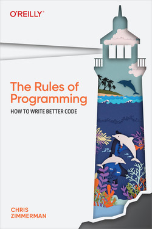

What follows are some heuristics for code quality or 'rules of programming' that
I stumbled across in various books and blogs. I'm referencing a rule because I
think it's interesting and relevant enough to retain for future reference, not
necessarily because I agree with it.

## Rules of Programming

Written by a game developer from Sucker Punch, and represent what works from
them in their c++ development cycle with years between releases of big projects
(games) and practical no back-wards compatibility requirements (between game
releases).

I found the book both fun and interesting, not all the rules apply to my daily
work, but I think each rules is well reasoned. Have to admit I struggled
understanding the C++ code examples though. I feel like several of the rules are
coming from a very different point of view of what I'm used to, so that was cool
too.

[Rules of programming; How to write better code; Zimmerman]

### As Simple as Possible, but No Simpler (Rule 1; KISS)

Overlapping **core** qualitative metrics:
- How much code is written?
- How many ideas are introduced?
- How much time does it take to explain?

'*If there isn't a simple solution to a problem, interrogate the problem before
you accept a complicated solution. Is the problem you're trying to solve,
actually the problem that needs solving? Or are you making unnecessary
assumptions about the problem that are complicating the solution?*' [p.8, Rules
of Programming; Zimmerman]

### Bugs are Contagious (Rule 2; Technical Debt)

It's useful to think of bugs as being contagious. Each bug in your system tends
to create new bugs, as new code works around the bug or relies on it's incorrect
behavior. The best way to stop the resulting contagion is to to eliminate the
bugs as soon as possible, before their evil influence can spread. [p.16, Rules
of Programming; Zimmerman]

One important strategy is to reduce the amount of state in your code. It's a lot
easier to test code that doesn't rely on state. [p.18, Rules of Programming;
Zimmerman]

Code that's easier to test - or better yet continually test itself - stays
healthier longer... The result is contagious bugs being discovered early, before
they have a chance to multiply. That means fewer problems to fix, and easier
fixes to make when fixes are necessary. [p.30, Rules of Programming; Zimmerman]

### A Good Name Is the Best Documentation (Rule 3, Consistency)

... Consistent naming patterns make it easier to track what's going on. It's
easier to identify the concept represented by a variable solely from its name,
without inspecting the code to infer its meaning. [p.39, Rules of Programming;
Zimmerman]

The key to consistency is for everything to be *as mechanical as possible*. If
our team's conventions for how things are named require judgment calls or
careful thought, then they won't work. Different programmers will make different
judgement calls, and everyone's names will be different. ...[p.40, Rules of
Programming; Zimmerman]

### Generalization Takes Three Examples (Rule 4, YAGNI+)

If you got one use cases, write code to solve that use case. Don't try to guess
what the second use case will be. Write code to solve problems you understand,
not ones you're guessing at. [p.48, Rules of Programming; Zimmerman]

When you're holding a hammer, everything looks like a nail, right? Creating a
*general* solution is handing out hammers. Don't do it until you're sure that
you've got a bag of nails instead of a bag of screws. [p.57, Rules of
Programming; Zimmerman]

### The First Lesson Of Optimization is Don't Optimize (Rule 5)

Make your code as simple as possible. Do't worry about how fast it will run.
It'll be fast enough. And if it's not, it will be easy to make fast. The last
bit - that it will be easy to make simple code fast - is the second lesson.
[p.63, Rules of Programming; Zimmerman]

Programmers worry too much about performance, full stop. [p.70, Rules of
Programming; Zimmerman]

The second lesson of optimization.
1. If you need to. Measure.
2. Make sure there's not a bug.
3. Measure your data.
4. Plan and prototype.
5. Optimize and repeat. [p.63-64, Rules of Programming; Zimmerman]
   
### Code Reviews are good For Three Reasons (Rule 6)

1. You'll find some bugs.
2. Everyone will understand the code better.
3. People will write code they're happy to share.
 [p.82, Rules of Programming; Zimmerman]
  
A healthy code review strengthens your codebase while it strengthens the bonds
of your team.  
...  
It's real time - two people sitting down at the same computer .. It's a dialogue
with the reviewer asking questions until they're satisfied they understand the
changes being made, suggesting changes, identifying things that need to be
tested, and discussing alternate approaches. Having the reviewee drive the
review is usually a mistake; it's too easy for the reviewer to just accept what
the reviewee says instead of thinking things through for themselves.  
...  
Usually one code review is enough. After the appropriate changes are made and
extra tests run, the reviewee commits the code.  
...  
Before you ask for a review, you walk through the diff yourself to make sure
you've tidied up anything embarrassing before showing it to someone else. 
[p.78-79, Rules of Programming; Zimmerman]

### Eliminate Failure Cases (Rule 7)

Or 'Detecting Mistakes Is Good, But Making Them Impossible to Express is Better.
[p.100, Rules of Programming; Zimmerman]  
  
References the 'Principle of Least
Astonishment' explained on Wiki by the following extracts;
  
In user interface design and software design, the principle of least
astonishment, also known as principle of least surprise, proposes that a
component of a system should behave in a way that most users will expect it to
behave, and therefore not astonish or surprise users. The following is a
corollary of the principle: "If a necessary feature has a high astonishment
factor, it may be necessary to redesign the feature."   
..   
People are part of the system. The design should match the user's experience,
expectations, and mental models.

[https://en.wikipedia.org/wiki/Principle_of_least_astonishment]

### Code That Isn't Running Doesn't Work (Rule 8)

It's simpler to assume that when we orphan something, it immediately stops
working. Over time, this is almost certainly true. We just won't know when it
happens. [p.111, Rules of Programming; Zimmerman]  

Recognizing that a bit of code has been orphaned and can be safely removed
should spark joy. Seriously, this should be the happiest moment in your week.
Your reducing the amount of code in your project, which makes everything easier,
without reducing functionality in any way. It's quick, it's easy, and everyone
is better of. [p.113, Rules of Programming; Zimmerman]  

### Write Collapsible Code (Rule 9)

The chapter leans pretty heavily into the same point as 'Code that fits in your
head'. I.e. work with a budget of less than 7'ish concepts per block and build
abstractions recursively up so you can leverage your short-term memory to
'briefly' understand a block and then reduce it to a single abstraction that's
more practical to continue work with.  

Furthermore the author points out the advantage for ease of understanding and
recall when of using terms that's commonly knowledge on the team; 'Common
knowledge is free; new concepts are expensive' (p. 127).

### Localize Complexity (Rule 10)

Similar in spirit to the principles of single responsibility and separation of
concern, albeit from a different angle. The author focus on how to manage
unavoidable complexity and how to still keep interactions between component
manageable.

>The thing you want to avoid at all costs is complicated interactions between
>different parts of your system. You can accept some complicated details, as long
>as the complexity is localized. ... If the *interactions* between components are
>complicated, things get out of control fast. If adding a new feature entails
>writing code in a lot of places, that's a bad sign. ... 
>
>[p.146, Rules of Programming; Zimmerman]  

### Is It Twice As Good? (Rule 11)

...make the big decision about whether to embark on a major rework or keep
making incremental changes.

Here's my simple rule of thumb for making a big change; is it twice as good?

If you're confident that after your changes, the reworked system will be twice
as good as the system you've got now, then the reward is big enough to justify
the disruption and the new problems that the rework will inevitably introduce. 

[p.151, Rules of Programming; Zimmerman]

### Big Teams Need Strong Conventions (Rule 12)

No comments.

### Find the Pebble That Started the Avalanche (Rule 13)

To make debugging easier; The author presents a few fuzzy suggestions.

His basic point, in my interpretation, is to write code that fail fast to avoid
errors becoming evident late in the chain of events, and that stateless
(functional) programming and event sourcing (executable log files) can make
retracing and recrating a bug much easier - and therefore also easier to solve.

### Code Comes in Four Flavors (Rule 14)

Good programmers make simple solutions for easy problems and complicated
solutions for hard problems, great programmers make simple solutions for both
easy and hard problems. 

[p.188, Rules of Programming; Zimmerman]

### Pull the Weeds (Rule 15)

Boy scouting, try to leave the code a bit better after finishing a task than when
you began it, the weed metaphor is apt because 'weeds breed more weeds' which
applies both to broken convention, technical debt and confusing comments, all
the stuff that makes the code more difficult to work with without applying to
the functionality..

### Work Backwards from Your Result, Not Forward From Your Code (Rule 16)

A bit of a forced rule in my opinion, his point is to put early emphasis on
identifying a good solution independent of what you already know and have at
hand. If you don't, the author argues that you'll risk a 'convenient solution,
that's inconvenient to use'[p.220, Rules of Programming; Zimmerman].

### Sometimes the Bigger Problem is Easier to Solve (Rule 17)

Very fuzzy chapter, the point seems to be, sometimes to find the right solution,
you'll have to find a different angle on the problem, like realize the issue can be formulated
as a flow problem and the some general algorithmic solution can be applied. 

In all the examples of the general solution being the simpler path, a major
change in perspective was necessary. The general solution represented a
completely different way of thinking about hte problem, and this new perspective
allowed a radically simpler solution.

[p.232, Rules of Programming; Zimmerman]

### Let Your Code Tell Its Own Story (Rule 18)

A chapter where the culture of the author diverges from what I'm used to by
talking at length about having good meaningful comments in the code. I'm used to
much more extreme avoidance of comments, because they tend to always end up
being lazy maintained and in the end misleading or directly false.

We do agree on his two sub-points, don't write comments or names that lie, and
don't write comments that's just fillers (because of convention or whatever).

The code (and in the opinion of the author also the comments) should tell a
clear story.

### Rework In Parallel (Rule 19)

'For each desired change, make the change easy (warning: this may be hard), the
make the easy change'. [P. 243, Kent Beck quote]

Bit fuzzy chapter, I'd interpret it as doing major changes using a feature
toggle and canary release, so kinda the Strangler Fig pattern
[learn.microsoft](https://learn.microsoft.com/en-us/azure/architecture/patterns/strangler-fig).

That is, implement the change but keep existing functionality, write an adaptor
that picks either the legacy or the new implementation based on a feature
toggle. Roll out the adaptor in the entire code base but keep feature toggle on
the legacy path. Roll out for a small set of users or testers and either
continue rolling out or roll back. Work towards everyone being toggled to use
the new implementation then remove the legacy code.

### Do the Math (Rule 20)

Another fuzzy chapter, if you consider doing something that takes time, consider
if it's worth the time to do by calculating the cost of implementing and compare
to a conservative measure of expected gain. I can't imagine I'll ever sit down
and 'do the math' like that but I can make a note of the argued tendency to
overestimate expected benefit and underestimate expected time to implement. 

### Sometimes You Just Need to Hammer the Nails (Rule 21)

Don't skip the drudgery. That unlovable task isn't going anywhere. There's no
hidden army of code elves who'll do the work while you're sleeping. And
half-completed tasks are a slow poison, working to kill your project. ...Once
you identify which tasks you tend to avoid, you can be more conscious of giving
them the priority they deserve. [p. 271-272, Rules of Programming; Zimmerman]

Imagine that you've got a big chunk of wood with a hundred nails sticking out of
it. They make it impossible to use the chunk of wood for anything else. You
could just ignore the nails. You could hope that someone else will hammer the
nails for you. You could spend a lot of time tinkering with a nail-hammering
machine that might work someday. - or you could just take out your hammer and
get to work. Sometimes you just need to hammer the nails. [p. 278, Rules of Programming; Zimmerman]

## Naming Things

TODO: Mark quotes as quotes and figure out a styling.